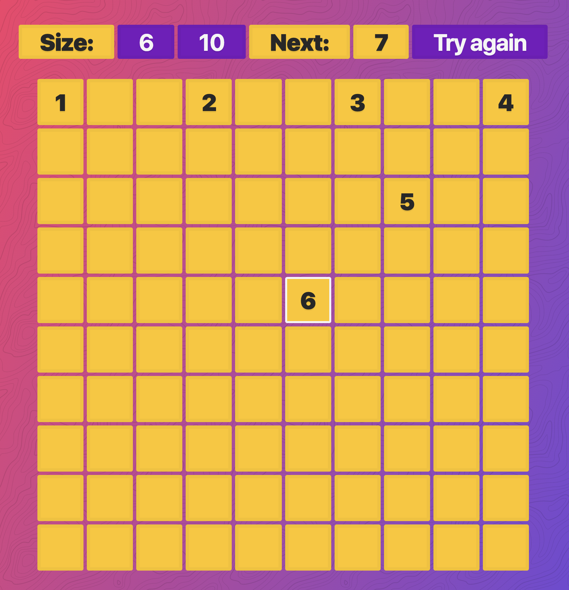

# Grid-game

## The game
A simple es6 javascript game.

## Instructions
Your goal is to fill every square in the grid. If you move horizontal or vertical, jump over two. If diagonal, jump over one. 

